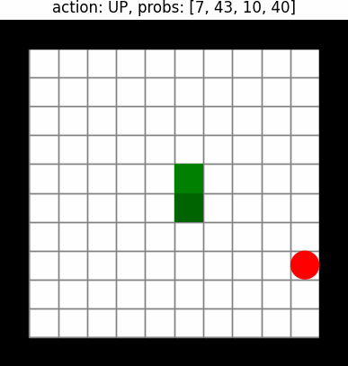
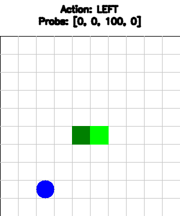

~~TODO A2C wrapper~~
~~TODO Trainer debugger~~
~~TODO grayscale option~~
~~TODO add observation stacking - based on memory argument~~
~~TODO random start~~
~~TODO model versioning - saving the model while training~~
TODO integrate config use: ~~Trainer~~ A2C, Snake
TODO PPO implementation
TODO reach score of 100

# This Repo is still a work in process
In this repo i implement several RL algorithms (DQN,DDQN Dueling DQN, A2C) and later on i plan to also use PPO in order to teach the agent to play snake.

