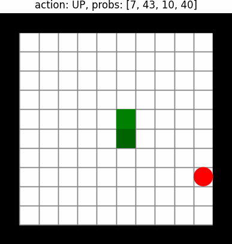

# This Repo is still a work in process
In this repo i implement several RL algorithms (DQN,DDQN Dueling DQN) and later on i plan to also use A2C and PPO in order to teach the agent to play snake.

  
